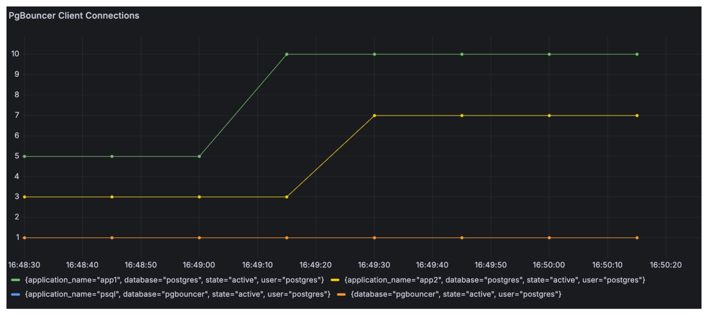

------------------------------------------------------------------------

[PgBouncer](https://www.pgbouncer.org/) is a connection pooler for Postgres. Postgres uses one process per connection, which can become problematic when creating large numbers of client connections. It can also be expensive to repeatedly drop and recreate these connections each time a client connects.

A common solution is to use a pooler that sits in front of your database. PgBouncer is one of the most popular options for Postgres. It maintains a pool of connections to Postgres that are reused across clients. Clients connect to PgBouncer, and from their perspective, it behaves the same as connecting directly to Postgres.

One of the things you might want to understand when deploying PgBouncer is the status of the various connections being made through it. This is similar to the information provided by the [pg_stat_activity](https://www.postgresql.org/docs/current/monitoring-stats.html#MONITORING-PG-STAT-ACTIVITY-VIEW) view in Postgres.

PgBouncer does not provide a `pg_stat_activity` view. Instead, it offers the [SHOW CLIENTS](https://www.pgbouncer.org/usage.html#admin-console) command, which you can run to inspect client connections. Here is an example of what that output looks like when using psql:


```sql
pgbouncer=# SHOW CLIENTS;
 type |   user   | database  | replication | state  |     addr      | port  |  local_addr   | local_port |      connect_time       |      request_time       | wait | wait_us | close_needed |      ptr       | link | remote_pid | tls | application_name | prepared_statements | id
------+----------+-----------+-------------+--------+---------------+-------+---------------+------------+-------------------------+-------------------------+------+---------+--------------+----------------+------+------------+-----+------------------+---------------------+----
 C    | postgres | pgbouncer | none        | active | 192.168.107.1 | 59281 | 192.168.107.3 |       6432 | 2026-03-21 21:35:54 UTC | 2026-03-21 21:35:57 UTC |    0 |       0 |            0 | 0xaaaadf56c9b0 |      |          0 |     | psql             |                   0 |  1
 ```

What if you want to view this information over time? That is where the [Prometheus exporter for PgBouncer](https://github.com/prometheus-community/pgbouncer_exporter) comes in. I recently contributed a feature that collects data from the `SHOW CLIENTS` command, which was included in the 0.12.0 release. You can now use the exporter to visualize `SHOW CLIENTS` data over time.

The metric name is `pgbouncer_client_connections`, and it includes the labels `database`, `user`, `application_name`, and `state`. Here is an example PromQL query:

```sql
sum by (database, user, application_name, state) (pgbouncer_client_connections)
```

Here is an example visualization where each series here shows # of connections for each application name: `psql`, `app1`, and `app2`.

{width=100% fig-align="center"}

You can use my repo, [pgbouncer-show-clients-demo](https://github.com/TylerHillery/pgbouncer-show-clients-demo) to try this out yourself.