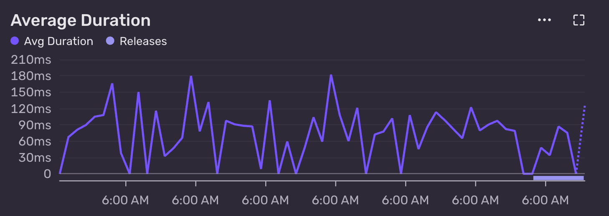

I noticed the SQLite query below had an average duration of ~90ms. 

```sql
select 
    package_name, 
    package_summary
from 
    pypi_packages
where 
    package_name like ?
order by 
    package_name
limit 
    10
```

{fig-align="center"}

`package_name` is the primary key and has an index on it. The table has 864,900 rows and is 166MB in size.

90ms for a query with a filter on the index, limited to 10 rows, on a table that is only 166 MB in size!? I would have expected something in the single digit millisecond range.

This query powers the active search results in [pypacktrends](https://pypacktrends.com), so as you type, package names start to appear. It takes the current value of the search input and appends `%` to match package names that start with the current prefix.

I ran a quick `explain query plan` to see what's going on:

```sql
.timer on
explain query plan 
select 
    package_name, 
    package_summary
from 
    pypi_packages
where 
    package_name like 'duck%'
order by 
    package_name
limit 
    10
-- QUERY PLAN
-- SCAN pypi_packages USING INDEX sqlite_autoindex_pypi_packages_1
-- Run Time: real 0.057 user 0.012548 sys 0.005846
```

Huh, 57ms and it's using a full index scan. After some [research](https://www.sqlite.org/lang_expr.html#the_like_glob_regexp_match_and_extract_operators), it turns out `like` is not case sensitive by default. Indexes, however, use binary collation by default. Collation is just the set of rules SQLite uses to compare and sort text (for example, whether A equals a, and how strings are ordered). 

Because the search is case insensitive but the index uses binary collation, SQLite isn't able to use the index efficiently. The simple fix is to make `like` case sensitive:

```sql
.timer on
PRAGMA case_sensitive_like = ON;
explain query plan 
select 
    package_name, 
    package_summary
from 
    pypi_packages
where 
    package_name like 'duck%'
order by 
    package_name
limit 
    10
-- QUERY PLAN
-- SEARCH pypi_packages USING INDEX sqlite_autoindex_pypi_packages_1 (package_name>? AND package_name<?)
-- Run Time: real 0.004 user 0.000486 sys 0.001236
```

4ms and `(package_name>? AND package_name<?)` shows we are now doing a range scan on the index. Much better.
