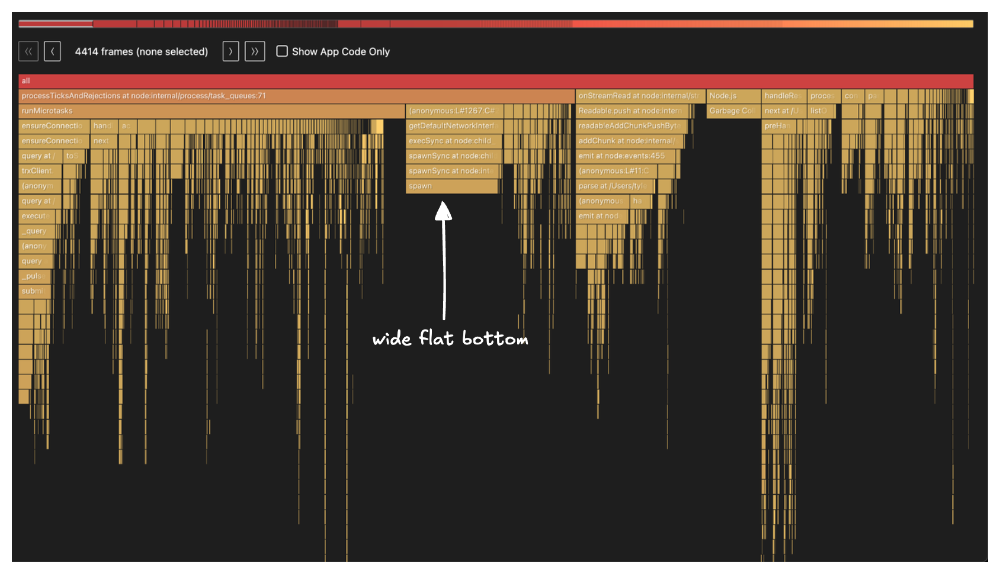
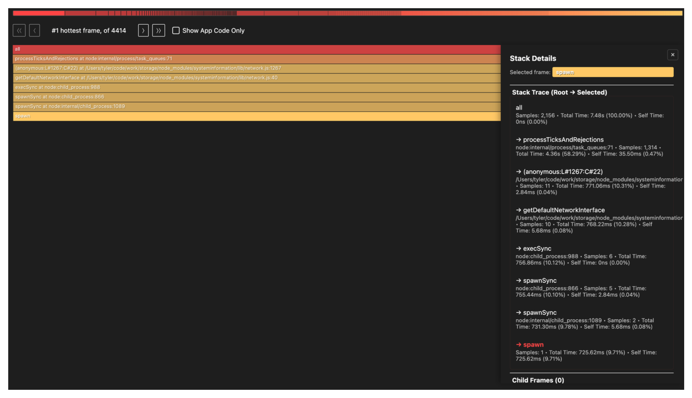
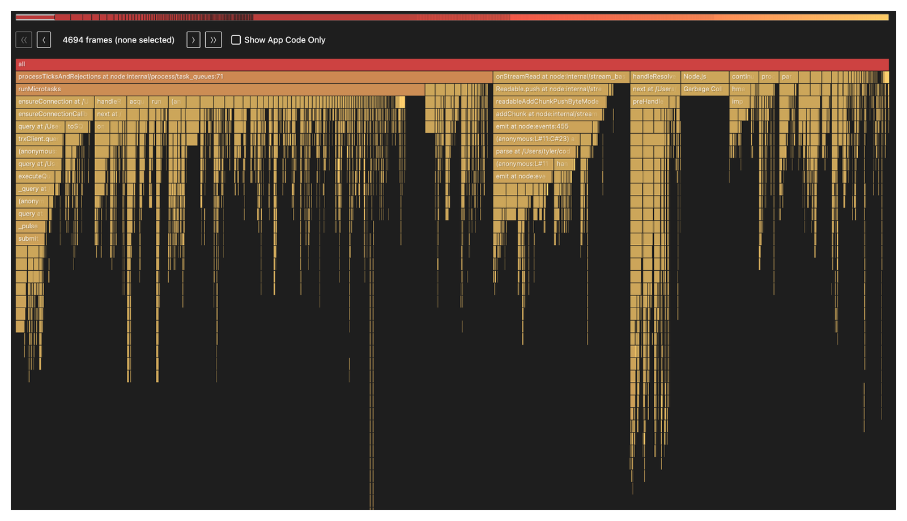
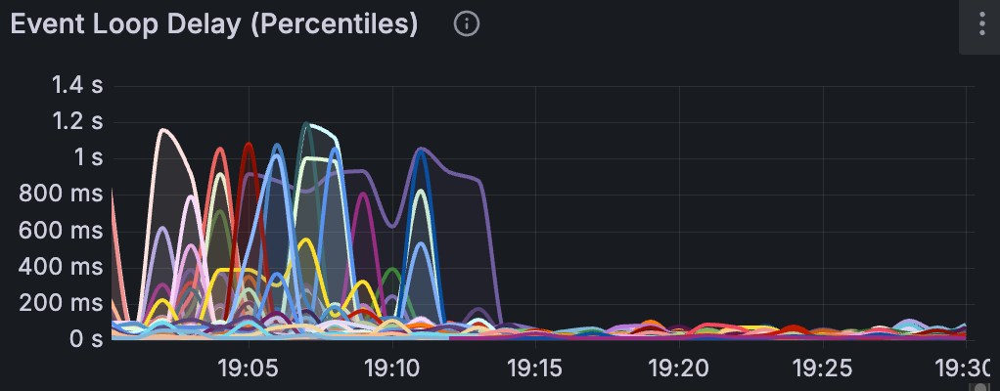

------------------------------------------------------------------------

I've been ramping up on Node.js for my new team at Supabase, and I've learned the first rule of Node.js club: Don't block the event loop.

{width=33% fig-align="center"}

I'm not going to get into the details of how the Node.js event loop works. Instead, I'll walk through my experience debugging an issue where a library was blocking it.

::: {.callout-note appearance="default" collapse=false title=""}
My favorite resources to learn about the event loop:

- [Node.js Docs - The Node.js Event Loop](https://nodejs.org/en/learn/asynchronous-work/event-loop-timers-and-nexttick)
- [Platformatic - The Node.js Event Loop](https://blog.platformatic.dev/the-nodejs-event-loop)
- [What the heck is the event loop anyway? | Philip Roberts | JSConf EU](https://www.youtube.com/watch?v=8aGhZQkoFbQ&t=1s)

:::

We made a change to enable [OpenTelemetry](https://opentelemetry.io/) using the open source npm libraries `@opentelemetry/*`. After deploying this change, our max CPU spiked to 100%. By the time I came online, a discussion was already underway with various hypotheses about the cause.

Coincidentally, I recently read a blog post, [Introducing Next-Generating Flamegraph Visualization in Node.js](https://blog.platformatic.dev/introducing-next-gen-flamegraphs-for-nodejs), and this seemed like the perfect use case for CPU profiling. 

This isn't my first time using flamegraphs. If you've read my blog post on [Tyler Tries Web Development](../tyler-tries-web-dev/#oom), I wrote about my experience with [memray](https://bloomberg.github.io/memray/), a Python memory profiler. I linked some good resources there about what they are and how to read them.

Here is how I set up our app for profiling:

```bash
➜ git clone https://github.com/supabase/storage.git
➜ cd storage
➜ cp .env.sample .env
➜ npm add -D @platformatic/flame
➜ npm install
➜ npm run infra:start
➜ npx flame run --manual dist/start/server.js
```

I then ran a [k6](https://k6.io/) script to generate some load on our app in a separate terminal:

```bash
➜ node src/test/k6/run-benchmark.cjs
```

Once the benchmark was over, I hit `CTRL+C` to stop the profiling and exit. This produced a CPU profile: `cpu-profile-2026-03-20T15-59-05-224Z.pb`. To create the flamegraph I ran:

```bash
➜ npx flame generate cpu-profile-2026-03-04T16-04-45-113Z
```

This produces an HTML and markdown file. Here is what the flamegraph looked like:

{width=100% fig-align="center"}

My main mental model when looking at flamegraphs is to look for the widest bottom of the flame. With this in mind, the stack frame labeled `spawn` caught my eye:

{width=100% fig-align="center"}

Going down the call stack, `spawn` is being called from `getDefaultNetworkInterface()` in `node_modules/systeminformation/lib/network.js` and it gets there via `execSync()`. Remember, the first rule of Node.js club is don't block the event loop. Yet, here we have a synchronous call.

Another nice benefit of the flame tool is the markdown report it generates which confirms our interpretation of the flamegraph:

::: {.callout-note appearance="minimal" title="Markdown Report" collapse="true"} 

### PPROF Analysis: CPU

**Profile:** `cpu-profile-2026-03-04T16-04-45-113Z.pb`
**Duration:** 452.4s | **Samples:** 2,156 | **Type:** sample (count)

#### Top Hotspots (by self-time)

| Rank | Function | Self% | Cum% | Location |
|------|----------|-------|------|----------|
| 1 | `spawn` | 10.3% | 10.3% | `<native>` |
| 2 | `Garbage Collection` | 5.8% | 5.8% | `<native>` |
| 3 | `runMicrotasks` | 2.3% | 40.5% | `<native>` |
| 4 | `writeBuffer` | 1.7% | 1.7% | `<native>` |
| 5 | `writev` | 1.5% | 1.5% | `<native>` |
| 6 | `redefineProperties` | 1.4% | 1.6% | `make-knex.js:240` |
| 7 | `onStreamRead` | 1.2% | 13.7% | `stream_base_commons:166` |

#### Critical Paths (top cumulative chains)

1. **[58.3%]** `runMicrotasks` → `ensureConnection` → `ensureConnectionCallback` → `query` → `trxClient.query` → `(anonymous:L#370:C#33)` → `query` → `executeQuery` → `_query` → `(anonymous:L#228:C#33)` → `query` → `_pulseQueryQueue` → `submit` → `Writable.uncork` → `clearBuffer` → `doWrite` → `Socket._writev` → `Socket._writeGeneric` → `writevGeneric` → `writev`
2. **[13.7%]** `Readable.push` → `readableAddChunkPushByteMode` → `addChunk` → `emit` → `(anonymous:L#11:C#23)` → `parse` → `(anonymous:L#111:C#19)` → `emit` → `_handleRowDescription` → `handleRowDescription` → `addFields` → `TypeOverrides.getTypeParser` → `getTypeParser`
3. **[10.3%]** `(anonymous:L#1267:C#22)` → `getDefaultNetworkInterface` → `execSync` → `spawnSync` → `spawnSync` → `spawn`
4. **[5.8%]** `Garbage Collection`
5. **[4.8%]** `next` → `preHandlerCallback` → `(anonymous:L#86:C#5)` → `uploadFromRequest` → `findBucketById` → `runQuery` → `(anonymous:L#131:C#12)` → `transaction` → `retry` → `run` → `RetryOperation.attempt` → `runAttempt` → `tnx.minTimeout` → `acquire` → `createKnexPool` → `knex` → `Client_PG` → `Client` → `initializeDriver` → `_driver` → `require` → `Hook._require.Module.require` → `patchedRequire` → `(anonymous:L#1335:C#35)` → `(anonymous:L#696:C#28)` → `resolveExports` → `finalizeEsmResolution` → `tryFile` → `toRealPath` → `realpathSync` → `wrappedFn`

#### Key Observations

- Native `spawn` dominates (**10.3%** self-time)

:::

It's clear that `spawn` is the main culprit, accounting for 10.3% of total CPU samples.

Unfortunately, the flamegraph doesn't show the full call path and stops at `node_modules/systeminformation/lib/network.js` so we have to do some grepping:

```bash
➜ rg "systeminformation/lib/network" -u -l 
node_modules/@opentelemetry/host-metrics/build/src/stats/si.js.map
node_modules/@opentelemetry/host-metrics/build/src/stats/si.js
```

```js
Object.defineProperty(exports, "__esModule", { value: true });
exports.getNetworkData = void 0;
// Import from the network file directly as bundlers trigger the 'osx-temperature-sensor' import in the systeminformation/lib/cpu.js,
// resulting in the following warning: "Can't resolve 'osx-temperature-sensor'"
// See https://github.com/open-telemetry/opentelemetry-js-contrib/pull/2071
const network_1 = require("systeminformation/lib/network");
function getNetworkData() {
    return new Promise(resolve => {
        (0, network_1.networkStats)()
            .then(resolve)
            .catch(() => {
            resolve([]);
        });
    });
}
exports.getNetworkData = getNetworkData;
```

This confirms `@opentelemetry/host-metrics` is what's calling into the `systeminformation/lib/network` module. This makes sense given our recent change to add OpenTelemetry. Now we just need to find where in our app we use it:

```bash
➜ rg "@opentelemetry/host-metrics" -l   
package.json
package-lock.json
src/internal/monitoring/otel-metrics.ts
```

Here is a condensed view of `src/internal/monitoring/otel-metrics.ts`:

```ts
import { HostMetrics } from '@opentelemetry/host-metrics'

// Initialize host metrics for Node.js runtime metrics
const hostMetrics = new HostMetrics({
  meterProvider,
  name: 'storage-api-host-metrics',
})
hostMetrics.start()
```

We found it! This is what the full call path ends up looking like:

```bash
  src/internal/monitoring/otel-metrics.ts:235
    └─ hostMetrics.start()
       └─ @opentelemetry/host-metrics → _createMetrics()
          └─ registers a batchObservableCallback
             └─ getNetworkData()               [si.js:25]
                └─ networkStats()              [systeminformation/lib/network.js]
                   └─ getDefaultNetworkInterface()
                      └─ execSync → spawnSync → spawn
```

The [fix](https://github.com/supabase/storage/pull/891) we did for now was a simple one liner to emit the network metrics group:


```diff
const hostMetrics = new HostMetrics({
  meterProvider,
  name: 'storage-api-host-metrics',
+ metricGroups: ['system.cpu', 'system.memory', 'process.cpu', 'process.memory'],
})
```

::: {.callout-note appearance="default" collapse=false title=""}
A long term fix is changing the `systeminformation` module itself to see if it can be made async. 

There is an open PR titled: [Use asynchronous operations everywhere to avoid blocking the main thread](https://github.com/sebhildebrandt/systeminformation/pull/948)

but it was opened in 2024-11-22 with the last activity on 2025-03-05 so it doesn't look like this will get merged anytime soon. 
:::

Here is a new flamegraph with the change:

{width=100% fig-align="center"}

Now for my favorite part, the event loop p99 latency across each of our app instances after we rolled out the fix:

{width=100% fig-align="center"}

Event loop latency measures how long a callback has to wait before the event loop picks it up. When the event loop is blocked by synchronous work, that wait time grows, meaning every request queued behind it is delayed. 

We saw consistent spikes to ~1s and you can infer when the deployment took place based on the nosedive in the charts.

So a reminder, don't block the event loop.